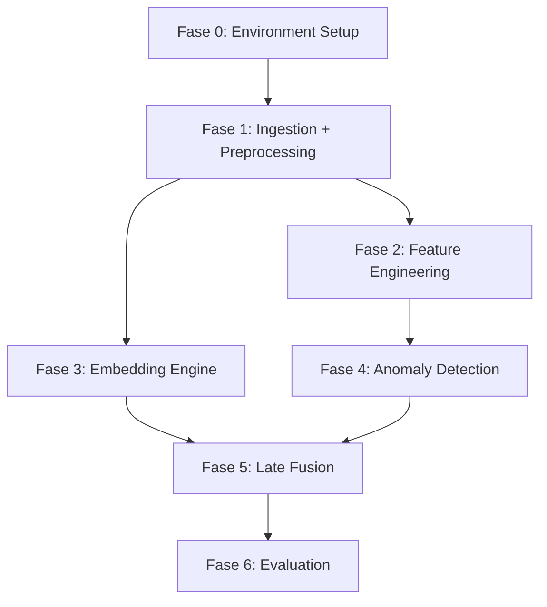

# Trust-Aware Recommender System — Implementation Plan

## Situazione Attuale (Research Findings)

| Aspetto | Stato |
|---------|-------|
| Dataset | `Electronics.jsonl` — **~44M record, ~21GB** (versione FULL, non 5-core) |
| Schema | 10 campi: `rating, title, text, images, asin, parent_asin, user_id, timestamp, helpful_vote, verified_purchase` |
| Python | 3.12.10 |
| Dipendenze | **Nessuna installata** (torch, polars, pandas, transformers, sklearn, peft, bitsandbytes tutti mancanti) |
| GPU | Da verificare post-installazione PyTorch (target: RTX 5070, 8GB VRAM) |

> [!IMPORTANT]
> Il dataset corrente è la versione **FULL** (~44M review), non la 5-core. Il primo step di ingestion applicherà il filtraggio iterativo 5-core, riducendo significativamente il volume (~stima 2-5M record).

---

## Architettura del Progetto (Directory Layout)

```
sTARS/
├── groundtruth.md                  # Source of truth
├── project_progress.log            # Auto-updated progress log (Skill A)
├── requirements.txt                # Dipendenze Python
├── config.py                       # Configurazione centralizzata (paths, hyperparams)
├── dataset/
│   └── Electronics.jsonl           # Raw dataset (~21GB)
├── data/                           # Dati processati (generati)
│   ├── electronics_5core.parquet   # Dataset filtrato 5-core
│   ├── features_behavioral.parquet # Feature comportamentali
│   └── embeddings/                 # Embedding Transformer cached
├── src/
│   ├── __init__.py
│   ├── ingestion.py                # Modulo 1: Data Loading & 5-core filtering
│   ├── preprocessing.py            # Modulo 2: Text cleaning (HTML/URL removal)
│   ├── feature_engineering.py      # Modulo 3: Behavioral features extraction
│   ├── embedding_engine.py         # Modulo 4: Transformer embedding (Stream A)
│   ├── anomaly_detector.py         # Modulo 5: Isolation Forest (Stream B)
│   ├── fusion.py                   # Modulo 6: Late Fusion ranking
│   └── evaluation.py              # Modulo 7: nDCG, Precision@K, Rank Shift
├── tests/
│   ├── __init__.py
│   ├── test_ingestion.py
│   ├── test_preprocessing.py
│   ├── test_feature_engineering.py
│   ├── test_embedding_engine.py
│   ├── test_anomaly_detector.py
│   ├── test_fusion.py
│   └── test_evaluation.py
└── notebooks/                      # Esplorazione e demo (opzionale)
    └── 01_eda.ipynb
```

---

## Proposed Changes

### Fase 0: Environment Setup

#### [NEW] [requirements.txt](file:///c:/Users/ciche/Desktop/Università/sTARS/requirements.txt)
Dipendenze del progetto con version pin:
```
polars>=1.0
pandas>=2.2
pyarrow>=15.0
torch>=2.3 (con CUDA 12.x)
transformers>=4.45
sentence-transformers>=3.0
peft>=0.13
bitsandbytes>=0.44
scikit-learn>=1.5
pytest>=8.0
tqdm
beautifulsoup4
```

#### [NEW] [config.py](file:///c:/Users/ciche/Desktop/Università/sTARS/config.py)
Configurazione centralizzata:
- Percorsi dataset/output
- Hyperparameters (batch sizes, 5-core threshold, LoRA rank/alpha)
- Device auto-detection (CUDA/CPU)

---

### Fase 1: Ingestion & Preprocessing

#### [NEW] [src/ingestion.py](file:///c:/Users/ciche/Desktop/Università/sTARS/src/ingestion.py)
**Obiettivo:** Caricare il dataset JSONL da ~21GB e applicare il filtraggio 5-core.

**Strategia (Memory-Efficient):**
1. **Scan Polars lazy** sul file JSONL per estrarre solo `user_id`, `parent_asin` e conteggi
2. **Filtraggio iterativo 5-core:** Loop che elimina utenti e item con <5 interazioni fino a convergenza
3. **Materializzazione:** Ri-scansione con filtro sui set di `user_id`/`parent_asin` sopravvissuti
4. **Output:** `data/electronics_5core.parquet` (formato colonnare, efficiente)

**Vincoli groundtruth:** Filtraggio 5-core come da specifica. Nessuna rimozione di dati testuali.

#### [NEW] [src/preprocessing.py](file:///c:/Users/ciche/Desktop/Università/sTARS/src/preprocessing.py)
**Obiettivo:** Pulizia minima del testo come da groundtruth (NO stop-words removal).

**Operazioni:**
1. Rimozione tag HTML (BeautifulSoup)
2. Rimozione URL (regex)
3. Normalizzazione whitespace
4. Concatenazione `title + " " + text` → campo `review_text`

---

### Fase 2: Feature Engineering (Stream B — Behavioral)

#### [NEW] [src/feature_engineering.py](file:///c:/Users/ciche/Desktop/Università/sTARS/src/feature_engineering.py)
**Obiettivo:** Estrarre feature comportamentali per ogni utente che alimenteranno l'Isolation Forest.

**Feature per utente (`user_id`):**

| Feature | Formula | Razionale |
|---------|---------|-----------|
| `review_count` | Count reviews per user | Volume attività |
| `avg_rating` | Mean(rating) | Tendenza al rating estremo |
| `rating_std` | Std(rating) | Variabilità dei voti |
| `rating_entropy` | Shannon entropy sulla distribuzione rating | Diversità dei punteggi |
| `pct_extreme` | % rating in {1.0, 5.0} | Polarizzazione |
| `pct_verified` | % verified_purchase=True | Genuinità acquisti |
| `avg_helpful` | Mean(helpful_vote) | Utilità percepita |
| `activity_span_days` | (max_ts - min_ts) in giorni | Finestra temporale |
| `burstiness` | Max reviews in qualsiasi finestra di 24h | Comportamento burst |
| `avg_text_length` | Mean(len(review_text)) | Sforzo nel testo |
| `unique_items_ratio` | Unique(parent_asin) / review_count | Diversificazione |

**Output:** `data/features_behavioral.parquet`

---

### Fase 3: Embedding Engine (Stream A — Content)

#### [NEW] [src/embedding_engine.py](file:///c:/Users/ciche/Desktop/Università/sTARS/src/embedding_engine.py)
**Obiettivo:** Generare dense vector embeddings del testo con un Transformer.

**Modello:** `sentence-transformers/all-MiniLM-L6-v2` (leggero, 80MB) come baseline, con opzione di upgrade a `all-mpnet-base-v2` o RoBERTa fine-tuned.

> [!NOTE]
> Il groundtruth specifica RoBERTa-base con PEFT/LoRA. L'approccio è progressivo:
> 1. **Baseline rapida** con Sentence-BERT pre-trained (no fine-tuning, inference-only)
> 2. **Upgrade** a RoBERTa-base + LoRA fine-tuned per task-specific embedding (Fase 4 futura)
>
> Questo permette di avere un sistema funzionante end-to-end prima di investire tempo nel fine-tuning.

**Strategia GPU-safe:**
- Batch inference con `batch_size` auto-calibrato per 8GB VRAM
- Salvataggio embedding su disco in chunked `.npy` files
- Caricamento memory-mapped per il ranking

**Output:** `data/embeddings/` directory con file numpy

---

### Fase 4: Anomaly Detection (Stream B — Trust Scorer)

#### [NEW] [src/anomaly_detector.py](file:///c:/Users/ciche/Desktop/Università/sTARS/src/anomaly_detector.py)
**Obiettivo:** Assegnare un Trust Score a ogni utente via Isolation Forest.

**Pipeline:**
1. Caricamento `features_behavioral.parquet`
2. Standard scaling delle feature
3. Fit `IsolationForest(n_estimators=200, contamination='auto', random_state=42)`
4. `decision_function()` → anomaly score continuo
5. Normalizzazione in `[0, 1]` → `trust_score` (1.0 = massima fiducia, 0.0 = probabile spammer)
6. Join trust_score sul dataset principale

**Output:** Colonna `trust_score` aggiunta al dataset

---

### Fase 5: Late Fusion Ranking

#### [NEW] [src/fusion.py](file:///c:/Users/ciche/Desktop/Università/sTARS/src/fusion.py)
**Obiettivo:** Combinare similarity semantica e trust per il ranking finale.

**Formula (da groundtruth):**
```
Score_Finale = Similarity_Score * Trust_Factor
```

Dove:
- `Similarity_Score` = cosine similarity tra user profile embedding e item embedding
- `Trust_Factor` = media pesata dei trust_score degli utenti che hanno recensito l'item

**User Profile:** Media degli embedding delle sue recensioni, pesata per trust_score.

**Ranking:** Per ogni utente nel test set, rank-ordina tutti i candidati item per `Score_Finale` e produci Top-K.

---

### Fase 6: Evaluation

#### [NEW] [src/evaluation.py](file:///c:/Users/ciche/Desktop/Università/sTARS/src/evaluation.py)
**Obiettivo:** Valutazione comparativa Baseline vs Trust-Aware.

**Metriche (da groundtruth):**
| Metrica | Descrizione |
|---------|-------------|
| nDCG@K | Normalized Discounted Cumulative Gain (K=5,10,20) |
| Precision@K | Precisione nelle Top-K raccomandazioni |
| Rank Shift | Variazione posizione degli item sospetti tra baseline e trust-aware |

**Protocollo:**
1. Split temporale (80/20 train/test basato su timestamp)
2. Baseline: ranking con solo Stream A (similarity pura)
3. Trust-Aware: ranking con Late Fusion (similarity × trust)
4. Report comparativo con analisi del Rank Shift

---

## Skills (Automated Workflows)

### Skill A: Project-State-Syncer
Dopo ogni file creato/modificato, aggiorno `project_progress.log` con:
- Timestamp
- Feature implementata
- Stato file core
- Prossimo step

### Skill B: Quality-Gate-Tester
Dopo ogni nuovo modulo, genero `tests/test_[module].py` con pytest e verifico che i test passino prima di procedere.

---

## User Review Required

> [!WARNING]
> **Dataset non è 5-core.** Il file `Electronics.jsonl` presente è la versione FULL (~44M record). Il filtraggio 5-core sarà applicato programmaticamente. Dopo il filtraggio, il dataset si ridurrà significativamente. Confermi che questo approccio è accettabile?

> [!IMPORTANT]
> **Dipendenze da installare.** Nessuna libreria Python richiesta è attualmente presente. Dovrò installare ~2GB di dipendenze (incluso PyTorch con CUDA). Procedo con l'installazione?

> [!IMPORTANT]
> **Strategia embedding progressiva.** Propongo di partire con Sentence-BERT pre-trained (inference-only, veloce) e successivamente fare upgrade a RoBERTa + LoRA come da groundtruth. Questo permette di avere un sistema end-to-end funzionante rapidamente. Accetti questo approccio incrementale?

---

## Open Questions

1. **Virtual Environment:** Preferisci usare un `venv` dedicato per il progetto, oppure installo le dipendenze nel Python globale?
2. **Subset per sviluppo:** Durante lo sviluppo, vorrai lavorare su un subset ridotto (es. 100K review) per iterare velocemente, per poi lanciare il pipeline completo alla fine?
3. **Fase 4 (Adversarial Evaluation):** Il documento menziona Data Poisoning come obiettivo futuro. Lo includo nel piano corrente o lo lasciamo per una fase successiva?

---

## Verification Plan

### Automated Tests
- `pytest tests/` dopo ogni modulo implementato (Quality Gate — Skill B)
- Validazione shape/types sui Parquet output
- Spot-check su sample di dati noti per ogni trasformazione

### Integration Test
- Pipeline end-to-end su subset di ~10K review
- Verifica che il ranking Trust-Aware produca effettivamente Rank Shift misurabile vs Baseline

### Manual Verification
- Ispezione visiva del `project_progress.log` per tracciabilità
- Review dei risultati nDCG/Precision@K per sanità dei valori

---

## Ordine di Esecuzione



Ogni fase è bloccante: non si procede alla successiva finché i test della fase corrente non passano (Quality Gate).
