# 🏃 Sprint Plan — Trust-Aware Recommender System

> Riferimento: [groundtruth.md](./groundtruth.md) | [implementation_plan.md](./implementation_plan.md)

---

## Sprint 0 — Bootstrap & Environment 🔧 ✅ COMPLETATO
**Durata stimata:** 1 sessione  
**Obiettivo:** Ambiente di sviluppo pronto e verificato.

| # | Task | Output | Stato |
|---|------|--------|-------|
| 0.1 | Creare virtual environment Python 3.12 | `venv/` | ✅ Done |
| 0.2 | Installare dipendenze (`requirements.txt`) | Pacchetti installati | ✅ Done |
| 0.3 | Creare `config.py` con paths e hyperparams | `config.py` | ✅ Done |
| 0.4 | Creare struttura directory (`src/`, `tests/`, `data/`) | Directories | ✅ Done |
| 0.5 | Inizializzare `project_progress.log` | Log file | ✅ Done |

**Quality Gate:** ✅ `pytest` eseguibile, GPU riconosciuta (RTX 5070, CUDA 13.2), import di tutte le dipendenze OK.

---

## Sprint 1 — Ingestion & 5-Core Filtering 📥 ✅ COMPLETATO
**Durata stimata:** 1-2 sessioni  
**Obiettivo:** Dataset filtrato, pulito e salvato in formato Parquet.

| # | Task | Output | Stato |
|---|------|--------|-------|
| 1.1 | Implementare `src/ingestion.py` — lettura JSONL + filtro 5-core iterativo | `find_5core_ids()` + `extract_and_save_5core()` | ✅ Done |
| 1.2 | Salvare output in `data/electronics_5core.parquet` | File Parquet | ✅ Done (logica pronta, materializzazione al primo run) |
| 1.3 | Implementare `src/preprocessing.py` — pulizia testo | `clean_text_columns()` | ✅ Done |
| 1.4 | Generare `tests/test_ingestion.py` (Skill B) | Test file | ✅ Passed |
| 1.5 | Generare `tests/test_preprocessing.py` (Skill B) | Test file | ✅ Passed |

> [!WARNING]
> **DA FARE al primo run:** Il file `electronics_5core.parquet` non esiste ancora su disco. Verrà creato alla prima esecuzione di `main.py --step ingest`. Questo step richiederà ~10-20 minuti a causa della scansione dei 21GB del JSONL raw. Le esecuzioni successive saranno istantanee (caching).

**Metriche attese:**
- Record originali: ~44M → Record post-5-core: ~2-5M (stima)
- Dimensione Parquet: ~1-3GB (vs 21GB raw)

---

## Sprint 2 — Feature Engineering (Stream B) 📊 ✅ COMPLETATO
**Durata stimata:** 1 sessione  
**Obiettivo:** Feature comportamentali per ogni utente pronte per l'Anomaly Detection.

| # | Task | Output | Stato |
|---|------|--------|-------|
| 2.1 | Implementare `src/feature_engineering.py` — 11 feature | `extract_behavioral_features()` | ✅ Done |
| 2.2 | Salvare `data/features_behavioral.parquet` | File Parquet | ✅ Done (logica pronta, materializzazione al primo run) |
| 2.3 | Generare `tests/test_feature_engineering.py` (Skill B) | Test file | ✅ Passed |

> [!WARNING]
> **DA FARE al primo run:** Anche `features_behavioral.parquet` non esiste ancora. Verrà generato al primo `main.py --step features`.

---

## Sprint 3 — Embedding Engine (Stream A) 🧠 ✅ COMPLETATO
**Durata stimata:** 2-3 sessioni  
**Obiettivo:** Embedding semantici densi per ogni recensione.

| # | Task | Output | Stato |
|---|------|--------|-------|
| 3.1 | Implementare `src/embedding_engine.py` — Sentence-BERT baseline | `generate_embeddings()`, `build_profiles()` | ✅ Done |
| 3.2 | Batch inference GPU-safe | `model.encode()` con batch_size configurabile | ✅ Done |
| 3.3 | Salvataggio embedding su `data/embeddings/` | File `.npy` | ✅ Done (logica pronta) |
| 3.4 | Calcolo User Profile embedding (media) | `user_profiles.npy` | ✅ Done |
| 3.5 | Calcolo Item embedding (media per item) | `item_profiles.npy` | ✅ Done |
| 3.6 | Generare `tests/test_embedding_engine.py` (Skill B) | Test file | ✅ Passed |

> [!WARNING]
> **DA FARE al primo run:** Il download del modello `all-MiniLM-L6-v2` (~80MB) e la generazione degli embedding (~2-5M testi) richiederanno diversi minuti. Peak VRAM atteso < 4GB per questo modello.

> [!NOTE]
> Il modello baseline è `all-MiniLM-L6-v2` (~80MB, 384-dim). L'upgrade a RoBERTa+LoRA è pianificato come Sprint 7 (opzionale).

---

## Sprint 4 — Anomaly Detection (Trust Scorer) 🔍 ✅ COMPLETATO
**Durata stimata:** 1 sessione  
**Obiettivo:** Trust Score per ogni utente basato su Isolation Forest.

| # | Task | Output | Stato |
|---|------|--------|-------|
| 4.1 | Implementare `src/anomaly_detector.py` — StandardScaler + IF | `extract_trust_scores()` | ✅ Done |
| 4.2 | Normalizzazione anomaly score → trust_score [0,1] | Colonna `trust_score` | ✅ Done |
| 4.3 | Join trust_score sul dataset feature | Dataset arricchito | ✅ Done |
| 4.4 | Generare `tests/test_anomaly_detector.py` (Skill B) | Test file | ✅ Passed |

> [!IMPORTANT]
> **Mancante (non bloccante):** L'analisi esplorativa dei top-50 utenti più anomali (task 4.4 originale) non è stata fatta come report separato. Verrà generata automaticamente nella stampa del report finale da `main.py`.

---

## Sprint 5 — Late Fusion & Ranking 🎯 ✅ COMPLETATO
**Durata stimata:** 1-2 sessioni  
**Obiettivo:** Sistema di raccomandazione completo con penalizzazione trust-aware.

| # | Task | Output | Stato |
|---|------|--------|-------|
| 5.1 | Implementare `src/fusion.py` — calcolo Trust Factor per item | `calculate_item_trust_factors()` | ✅ Done |
| 5.2 | Calcolo Similarity Score (cosine sim user↔item) | Matrice numpy | ✅ Done |
| 5.3 | Calcolo Score Finale = Similarity × Trust_Factor | `generate_ranking()` | ✅ Done |
| 5.4 | Generazione Top-K raccomandazioni per utente | Liste Top-K (K=5,10,20) | ✅ Done |
| 5.5 | Pipeline Baseline (solo similarità, senza trust) | Ranking baseline | ✅ Done |
| 5.6 | Generare `tests/test_fusion.py` (Skill B) | Test file | ✅ Passed |

---

## Sprint 6 — Evaluation & Report 📈 ✅ COMPLETATO
**Durata stimata:** 1-2 sessioni  
**Obiettivo:** Valutazione quantitativa completa con confronto Baseline vs Trust-Aware.

| # | Task | Output | Stato |
|---|------|--------|-------|
| 6.1 | Implementare `src/evaluation.py` — nDCG, Precision, Rank Shift | `ndcg_at_k()`, `precision_at_k()`, `calculate_rank_shift()` | ✅ Done |
| 6.2 | Split temporale 80/20 | Integrato in `main.py` step_evaluate() | ✅ Done |
| 6.3 | Generazione report comparativo | `results/evaluation_report.md` | ✅ Done (generato al run) |
| 6.4 | Generare `tests/test_evaluation.py` (Skill B) | Test file | ✅ Passed |

**Output atteso al primo run:**
```
══════════════════════════════════════════════════════════
  RISULTATI EVALUATION
══════════════════════════════════════════════════════════
  Metrica               Baseline   Trust-Aware      Delta
  ──────────────────────────────────────────────────────
  nDCG@5                  0.XXXX       0.XXXX     -0.XXXX
  nDCG@10                 0.XXXX       0.XXXX     -0.XXXX
  Precision@5             0.XXXX       0.XXXX     -0.XXXX
  Precision@10            0.XXXX       0.XXXX     -0.XXXX

  Rank Shift medio: -X.XX
══════════════════════════════════════════════════════════
```

> La flessione delle metriche classiche è una **feature**, non un bug — dimostra che il sistema penalizza contenuti manipolati.

---

## Sprint 7 — RoBERTa + LoRA Fine-Tuning (Upgrade) 🚀 ⏳ NON SVOLTO
**Durata stimata:** 2-3 sessioni  
**Obiettivo:** Sostituire Sentence-BERT baseline con RoBERTa-base fine-tuned via LoRA.
**Stato:** ⏳ *Opzionale — da attivare dopo Sprint 6 completato*

| # | Task | Output | Stato |
|---|------|--------|-------|
| 7.1 | Preparare dataset per fine-tuning (triple: anchor, positive, negative) | Dataset NLI-style | ❌ Da fare |
| 7.2 | Configurare PEFT/LoRA su RoBERTa-base | Modello con adapter | ❌ Da fare |
| 7.3 | Fine-tuning con 4-bit quantization (bitsandbytes) | Modello salvato | ❌ Da fare |
| 7.4 | Ri-generare embedding con nuovo modello | Nuovi file .npy | ❌ Da fare |
| 7.5 | Ri-eseguire evaluation comparativa | Report aggiornato | ❌ Da fare |

> [!NOTE]
> Questo sprint richiede la creazione di un dataset di triple (anchor, positive, negative) a partire dalle interazioni user-item per addestrare il modello in modalità contrastiva. Va valutato se il guadagno in nDCG giustifica il costo computazionale (stima ~2-4 ore di fine-tuning su RTX 5070).

**Quality Gate:** Fine-tuning completo senza OOM. Embedding RoBERTa producono nDCG ≥ SBERT baseline.

---

## Sprint 8 — Adversarial Evaluation (Fase 4 Futura) ⚔️ ⏳ NON SVOLTO
**Durata stimata:** 2-3 sessioni  
**Obiettivo:** Validare robustezza del sistema sotto attacco Data Poisoning.
**Stato:** ⏳ *Bassa priorità — come da documento di progetto, Fase 4*

| # | Task | Output | Stato |
|---|------|--------|-------|
| 8.1 | Implementare generatore di bot sintetici (Average Attack) | Funzione `generate_attack()` | ❌ Da fare |
| 8.2 | Implementare Bandwagon Attack | Variante d'attacco | ❌ Da fare |
| 8.3 | Iniettare bot nel dataset | Dataset avvelenato | ❌ Da fare |
| 8.4 | Ri-esecuzione pipeline completa su dataset avvelenato | Ranking post-attacco | ❌ Da fare |
| 8.5 | Misurazione Rank Shift del Target item | Report resilienza | ❌ Da fare |
| 8.6 | Confronto Baseline vs Trust-Aware sotto attacco | Report finale | ❌ Da fare |

**Quality Gate:** Il sistema Trust-Aware assorbe l'attacco e il Target item precipita fuori dal Top-K, mentre nel Baseline sale.

---

## 🚀 Come Eseguire la Pipeline

### Prerequisito
Attivare il virtual environment:
```bash
# Windows (PowerShell)
.\venv\Scripts\Activate.ps1
```

### Pipeline completa (tutti e 6 gli step)
```bash
python main.py
```

### Singolo step (con caching automatico)
```bash
python main.py --step ingest      # Solo ingestion & 5-core
python main.py --step preprocess   # Solo pulizia testo
python main.py --step features    # Solo feature engineering
python main.py --step embed       # Solo embedding (GPU)
python main.py --step anomaly     # Solo Isolation Forest
python main.py --step evaluate    # Solo Late Fusion + Metriche
```

### Output generati
```
data/
├── electronics_5core.parquet         # Dataset filtrato 5-core
├── electronics_5core_clean.parquet   # con review_text pulito
├── features_behavioral.parquet       # Feature + trust_score
├── embeddings/
│   ├── reviews_embeddings.npy        # Embedding per review
│   ├── user_profiles.npy             # Profilo medio per utente
│   └── item_profiles.npy             # Profilo medio per item
└── rankings/
    ├── baseline.pkl                  # Ranking senza trust
    └── trust_aware.pkl               # Ranking con trust

results/
└── evaluation_report.md              # Report comparativo finale
```

### Tempi stimati (prima esecuzione)

| Step | Tempo stimato | Nota |
|------|---------------|------|
| Ingestion | 10-20 min | Scansione 21GB JSONL |
| Preprocessing | 1-3 min | Regex su ~2-5M righe |
| Feature Engineering | 1-2 min | Aggregazioni Polars |
| Embedding | 15-45 min | GPU, dipende da N record |
| Anomaly Detection | <1 min | Isolation Forest CPU |
| Evaluation | 2-5 min | Matrice coseno + metriche |
| **Totale** | **~30-75 min** | Prima esecuzione |

Le esecuzioni successive saranno **molto più rapide** grazie al caching: ogni step controlla se il suo output esiste già prima di ricalcolare.

### Esecuzione test
```bash
python -m pytest tests/ -v
```

---

## Riepilogo Stato

```mermaid
gantt
    title Trust-Aware Recommender — Stato Sprint
    dateFormat X
    axisFormat %s

    section Completati ✅
    Sprint 0 - Bootstrap          :done, s0, 0, 1
    Sprint 1 - Ingestion          :done, s1, after s0, 2
    Sprint 2 - Feature Eng.       :done, s2, after s1, 1
    Sprint 3 - Embedding          :done, s3, after s1, 3
    Sprint 4 - Anomaly Detection  :done, s4, after s2, 1
    Sprint 5 - Fusion             :done, s5, after s3, 2
    Sprint 6 - Evaluation         :done, s6, after s5, 2

    section Da fare ⏳
    Sprint 7 - RoBERTa+LoRA       :s7, after s6, 3
    Sprint 8 - Adversarial        :s8, after s7, 3
```



| Sprint | Stato | Note |
|--------|-------|------|
| 0 — Bootstrap | ✅ Completato | venv + CUDA + dipendenze |
| 1 — Ingestion | ✅ Completato | Codice pronto, dati generati al primo run |
| 2 — Feature Eng. | ✅ Completato | 11 feature comportamentali |
| 3 — Embedding | ✅ Completato | Sentence-BERT baseline |
| 4 — Anomaly Det. | ✅ Completato | Isolation Forest + trust_score |
| 5 — Fusion | ✅ Completato | Late Fusion (Similarity × Trust) |
| 6 — Evaluation | ✅ Completato | nDCG, Precision@K, Rank Shift |
| **7 — RoBERTa+LoRA** | **⏳ Non svolto** | **Opzionale: fine-tuning contrastivo** |
| **8 — Adversarial** | **⏳ Non svolto** | **Bassa priorità: Data Poisoning test** |

> [!TIP]
> Gli Sprint 2 e 3 possono procedere in **parallelo** dopo il completamento dello Sprint 1, accelerando il timeline complessivo.
